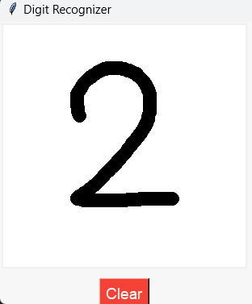
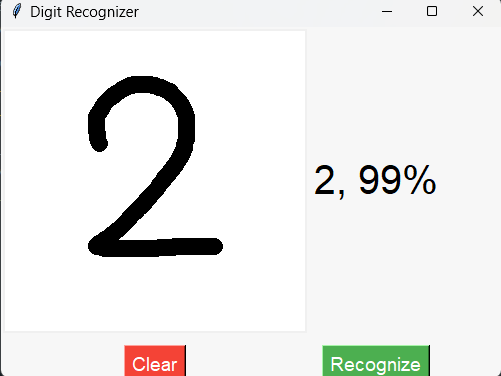

# MNIST Digit Recognizer with Keras and Tkinter

This project demonstrates a complete pipeline for training a deep learning model to recognize handwritten digits using the MNIST dataset. The model is trained using convolutional neural networks (CNNs) with data augmentation. The trained model is then used in a Tkinter GUI, where users can draw digits, and the model will predict the digit in real-time.

Made with ❤️ by [Smit Zaveri](https://github.com/Smit-Zaveri).

## Dependencies

- **TensorFlow/Keras**: A deep learning framework used to train and build the model.
- **OpenCV**: Used for various computer vision tasks.
- **Pillow**: Used for image processing in the GUI.
- **NumPy**: A fundamental library for numerical operations in Python.
- **Tkinter**: Python’s standard GUI library used to create the digit drawing interface.

## Installation

1. Clone this repository:
   ```bash
   git clone https://github.com/Smit-Zaveri/Models.git
   cd Models
   cd MNIST-Digit-Recognizer
   ```

2. Install the required dependencies:
   ```bash
   pip install -r requirements.txt
   ```

   Alternatively, you can install dependencies individually:
   ```bash
   pip install tensorflow opencv-python pillow numpy
   ```

3. (Optional) If you're on Windows, you need to install the `pywin32` package to capture the canvas in Tkinter:
   ```bash
   pip install pywin32
   ```

## Dataset and Model Training

The MNIST dataset is loaded from `tensorflow.keras.datasets` and preprocessed for use with a convolutional neural network (CNN). Data augmentation is applied using `ImageDataGenerator` to improve the model's generalization.

### Training the Model

1. The model is built using several convolutional layers with `ReLU` activation and dropout to prevent overfitting.
2. Data augmentation is applied to the training data, and the model is trained for 20 epochs using `Adam` optimizer.
3. The final trained model is saved as `mnist_augmented.h5`.

### Running the Training Code

To train the model:

```bash
python train_mnist.py
```

## Digit Recognizer GUI

Once the model is trained, the `mnist_augmented.h5` file is loaded into a Tkinter-based application that allows users to draw digits on a canvas. The model predicts the digit and displays the result along with the confidence score.

### Running the GUI Application

```bash
python digit_recognizer_gui.py
```

### How it works:
1. **Draw a digit**: Use the mouse to draw a digit on the canvas.
2. **Recognize**: Press the "Recognize" button to classify the digit.
3. **Clear**: Press the "Clear" button to erase the canvas and start again.

The model predicts the digit with a confidence score based on the trained MNIST model.

## Model Architecture

The neural network model uses the following architecture:
- **Input Layer**: Accepts 28x28 grayscale images.
- **Conv2D Layers**: Two convolutional layers with `ReLU` activation.
- **MaxPooling2D**: For down-sampling the feature maps.
- **Dropout**: To prevent overfitting.
- **Dense Layer**: Fully connected layer for classification.
- **Output Layer**: Softmax activation to predict the digit (0-9).

## Example Screenshots

| Drawing a Digit | Prediction |
|:---------------:|:----------:|
|  |  |

## Usage

### Steps:
1. Clone the repository and install the dependencies.
2. Run the `train_mnist.py` script to train the model.
3. Use the Tkinter GUI (`digit_recognizer_gui.py`) to draw digits and get predictions.

### Notes:
- The `ImageDataGenerator` is used to augment the dataset, improving the generalization of the model.
- The model is saved to `mnist_augmented.h5` after training and is used in the GUI for digit prediction.
